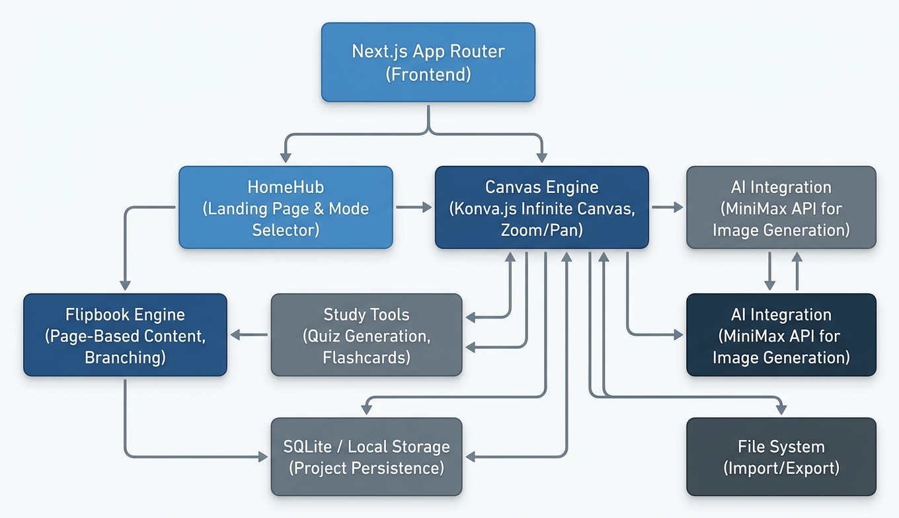
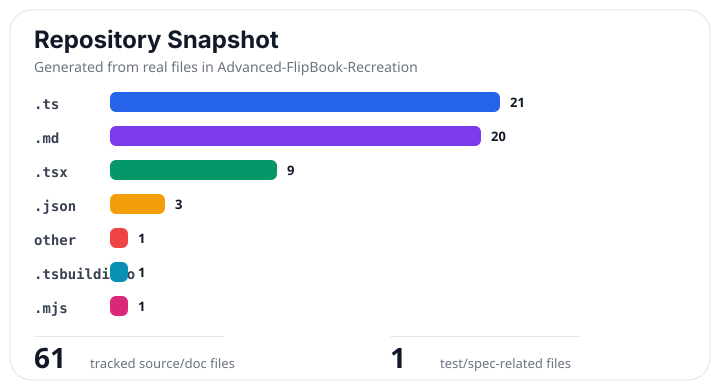
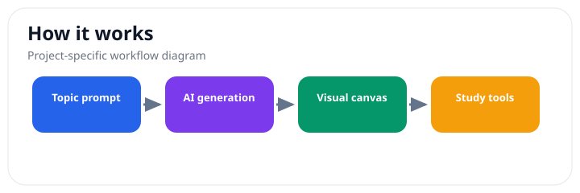

# Lumen Atlas - Interactive AI Flipbook Workspace

> Status: prototype/beta. Lumen Atlas is a local AI visual knowledge workspace; some generation and exploration flows may still change as the product matures.

Lumen Atlas lets users generate interactive flipbooks, click visual regions to explore ideas, branch into connected pages, and study topics through tools like Learn, Ask, Analyze, Compare, Timeline, Sources, and Study Guide.

## Why Use Lumen Atlas?

- Turns a topic into a visual, explorable knowledge workspace.
- Supports branching pages instead of one linear chat answer.
- Combines canvas exploration with study and analysis tools.
- Keeps research, generated pages, and follow-up questions in one local interface.

## Current Limitations

- AI generation quality depends on the configured provider and prompt quality.
- Some workflows are experimental and should be checked before serious study use.

## Privacy and Data Handling

- Project data is stored locally with SQLite unless you add your own deployment/storage layer.
- API keys belong in `.env.local` and should never be committed.
- Prompts, source material, and generated content can be sent to the configured AI provider when generation or chat features are used.
- Generated images and local artifacts may be written under project/public generated paths depending on your setup.
- Do not use private or sensitive source material unless you understand your local storage and selected AI provider.
- See [SECURITY.md](SECURITY.md) for vulnerability reporting and secret-handling guidance.

**A local-first AI visual knowledge workspace** where users generate interactive flipbooks, explore topics by clicking visual regions, branch into connected pages, and use tools like Learn, Ask, Analyze, Compare, Timeline, Sources, and Study Guide on an infinite canvas.

Built with Next.js 16, React 19, TypeScript, and SQLite — all data stays on your machine.

## Architecture



*Three UI layers (HomeHub, Canvas, Right Panel) connect through Next.js API routes to SQLite persistence and MiniMax image generation.*

## Features

- **Visual-First Learning** — Generate and explore topics through clickable visual flipbooks
- **Infinite Canvas** — Drag, resize, and connect knowledge objects freely
- **8 Feature Modes** — Flipbook, Textbook Image, Knowledge Map, Timeline, Compare, Study Guide, Source Brief, Presentation
- **12 Canvas Tools** — Select, Pan, New Flipbook, Organize, Learn, Ask, Analysis, Compare, Timeline, Sources, Regenerate, Export
- **AI Image Generation** — MiniMax API integration with deterministic SVG fallback
- **Source-Aware** — Track sources with quality ratings; enforce strict/balanced/off source modes
- **Project Memory** — Explicit, project-scoped memory with facts, summaries, and pinned items
- **Chat Operator** — AI chat bubble with context-aware operator actions
- **Local SQLite Persistence** — All data stored locally, no cloud dependency
- **Version Snapshots** — Automatic snapshots for restore points
- **Responsive Design** — Works on desktop (1440px+), tablet (768px), and mobile (390px)
- **Accessibility** — ARIA labels, keyboard navigation, focus-visible states, reduced-motion support

## Feature Modes

| Mode | Description |
|------|------------|
| **Flipbook** | Explore a topic by clicking generated visual regions |
| **Textbook Image** | Create structured explainer images with transcript text |
| **Knowledge Map** | Turn a topic into a connected concept map |
| **Timeline** | Build a chronological visual branch |
| **Compare** | Compare two ideas, eras, systems, or sources |
| **Study Guide** | Generate review notes, questions, and explanations |
| **Source Brief** | Summarize sources with claims and confidence ratings |
| **Presentation** | Build a concise visual teaching sequence |

## Tech Stack

| Layer | Technology | Version |
|-------|-----------|---------|
| Framework | Next.js (App Router + Turbopack) | 16.2.6 |
| UI | React | 19.0.0 |
| Language | TypeScript (strict mode) | 5.7.2 |
| Database | better-sqlite3 (WAL mode, foreign keys) | 11.9.1 |
| Image Generation | MiniMax API (image-01 model) | — |
| Validation | Zod | 3.24.1 |
| Styling | Custom CSS (no Tailwind) | — |

## Quick Start

```bash
git clone https://github.com/Evan1108-Coder/Advanced-FlipBook-Recreation.git
cd Advanced-FlipBook-Recreation
npm install
cp .env.example .env.local
# Edit .env.local and add your MINIMAX_API_KEY (optional — works without it)
npm run dev
```

See [SETUP.md](SETUP.md) for detailed setup instructions and [ENVREADME.md](ENVREADME.md) for environment variable documentation.

<details>
<summary>Project Structure</summary>

```
Advanced-FlipBook-Recreation/
├── app/                          # Next.js App Router
│   ├── layout.tsx                # Root HTML layout
│   ├── page.tsx                  # Main app page
│   ├── globals.css               # Global styles + theme
│   └── api/
│       ├── projects/             # CRUD for projects
│       ├── generate/             # Image generation + tool execution
│       └── chat/                 # Chat messages
├── components/
│   ├── HomeHub.tsx               # Landing page
│   ├── WorkspaceCanvas.tsx       # Infinite canvas
│   ├── FloatingToolbar.tsx       # Canvas toolbar
│   ├── RightPanel.tsx            # Side panel with 11 sections
│   ├── ChatBubble.tsx            # AI chat interface
│   ├── ConnectorLayer.tsx        # SVG connection lines
│   └── SettingsControls.tsx      # Reusable form controls
├── lib/
│   ├── db.ts                     # SQLite database layer
│   ├── types.ts                  # TypeScript type definitions
│   ├── minimax.ts                # MiniMax image client
│   ├── validation.ts             # Input sanitization
│   ├── defaults.ts               # Feature modes + tool definitions
│   ├── api.ts                    # Request validation helpers
│   └── id.ts                     # ID generation + timestamps
├── docs/                         # Design docs + reference
└── public/generated/             # Generated images (gitignored)
```

</details>

## Reference Docs

| Topic | Document |
|-------|----------|
| Canvas objects, types, and properties | [docs/CANVAS_OBJECTS.md](docs/CANVAS_OBJECTS.md) |
| Right panel sections | [docs/RIGHT_PANEL.md](docs/RIGHT_PANEL.md) |
| AI chat and operator actions | [docs/AI_CHAT.md](docs/AI_CHAT.md) |
| Settings system | [docs/SETTINGS.md](docs/SETTINGS.md) |
| Product vision | [docs/00-product-brief.md](docs/00-product-brief.md) |
| UI layout spec | [docs/01-information-architecture.md](docs/01-information-architecture.md) |
| Technical architecture | [docs/02-architecture.md](docs/02-architecture.md) |
| Settings inventory | [docs/03-settings-inventory.md](docs/03-settings-inventory.md) |
| Coding guidelines | [docs/04-agent-brief.md](docs/04-agent-brief.md) |
| Testing checklist | [docs/05-test-plan.md](docs/05-test-plan.md) |
| Setup guide | [SETUP.md](SETUP.md) |
| Environment variables | [ENVREADME.md](ENVREADME.md) |
| Troubleshooting | [TROUBLESHOOTING.md](TROUBLESHOOTING.md) |
| Contributing | [CONTRIBUTING.md](CONTRIBUTING.md) |

## Scripts

```bash
npm run dev        # Start development server (Turbopack)
npm run build      # Production build
npm start          # Start production server
npm run lint       # Run ESLint
npm run typecheck  # TypeScript type checking (tsc --noEmit)
```

## License

MIT License — see [LICENSE](LICENSE)

## Real Visual Snapshot

These visuals are generated from the actual repository structure and project workflow, not placeholders.




