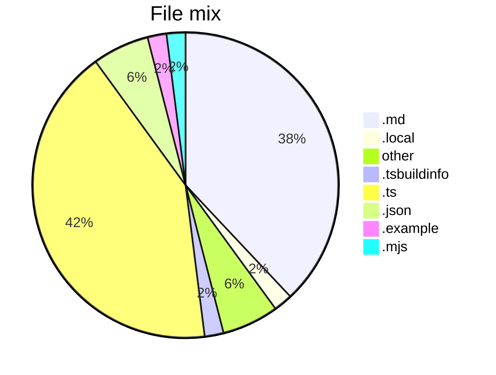

# Project Snapshot

Generated from the repository tree for public maintenance polish.

- `.ts`: 21 files
- `.md`: 19 files
- `.tsx`: 9 files
- `no extension`: 3 files
- `.json`: 3 files
- `.local`: 1 files
- `.tsbuildinfo`: 1 files
- `.example`: 1 files
- `.mjs`: 1 files
- `.css`: 1 files

